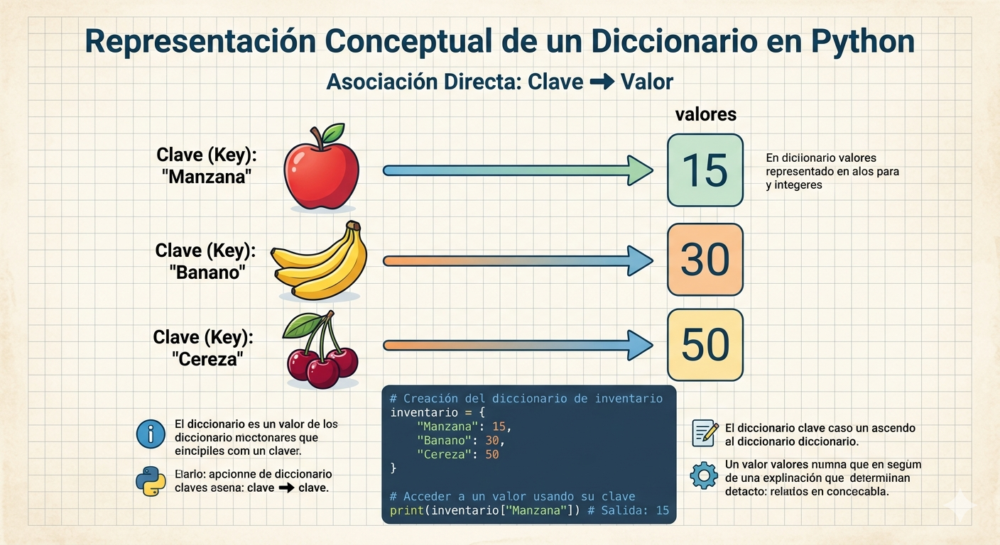

# diccionarios_python
conceptos y ejercicios en python

- los diccionarios son datos estructurados, es decir hacen referncia a una coleccion de datos

- son una coleccion desordenada de pare de la forma **clave:valor**, conocidos como elementos o items

- son mutables, una vez definido se le pueden agregar nuevos elementos, modificar o eliminar algunos de los que ya tiene
-tambien son conocidos como arreglos asociativos

### Representacion grfica de un diccionario



## sintaxis

`nombre_diccionario = {clave1:valor1, clave2:valor2...}`

- cada item o elemnto tiene la forma **clave: valor**
- en cada item hay una clave y uno o mas valores. si se desconoce el valor se puede completar con *none*
- los elemtos del diccionario se indexan por clave
- las claves solo pueden ser datos imutables
- los claves no pueden repetirse dentro un diccionario

### Ejemplo

`frutas = {'manzan':34, 'pera':45}`

## Operaciones

### Agregar elementos

` nombre diccionario[clave] =`

` frutas['cereza'] = 90`

### Consultar o modificar elementos

` print('El valor de pera es: ', fruta['pera'])`


### Eliminar elementos

`del frutas['pera']`

### Operador de pertenencia

```py
if 'cereza' in frutas:
    print('si esta cereza en el diccionario')
else:
     print('no esta cereza en el diccionario')
```
## Ejercicio 
Cree un programa en Python que utilice un diccionario para guardar los nombres de sus amigos y su telefono.  En este caso, el diccionario representa una agenda telefónica.  El programa pedirá nombres y telefonos y los irá guardando en el diccionario (los nombres en mayúscula).  Además, el programa debe permitir consultar o eliminar un telefono.  Incluya un menú de opciones.
